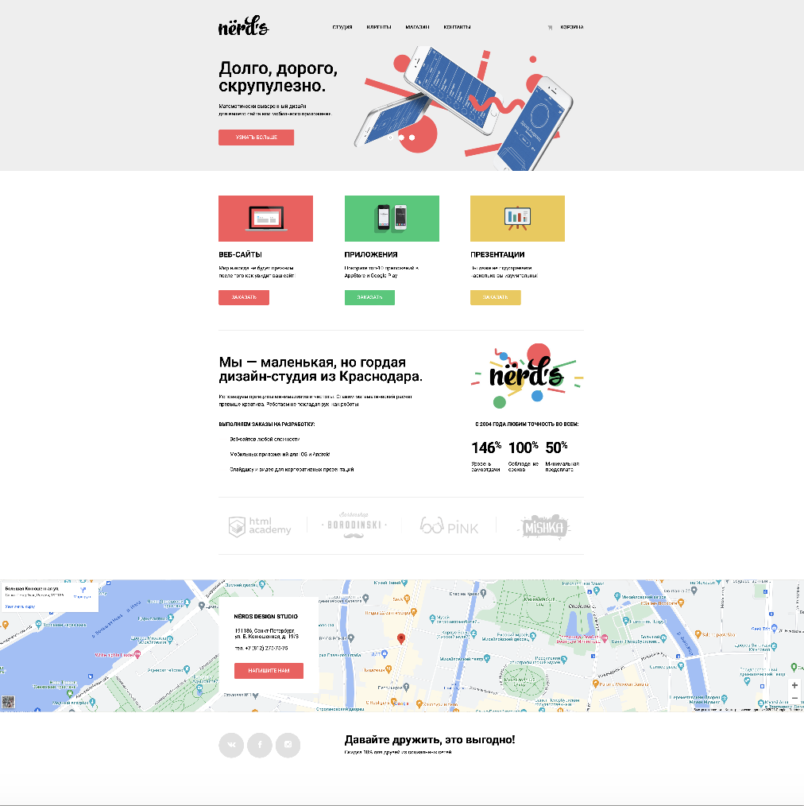

# Личный проект «{{Nerds}}»

Решение для [Nerds](https://nerds2.github.io/index.html#).

## Обзор

Nerds — сайт дизайн-студии.

### Скриншот

### Ссылки

- Live Site URL: [Nerds](https://nerds2.github.io/index.html#)

### Использумые технологии

- HTML
- CSS
- JavaScript
- Фиксированная вёрстка

### Изучено

В ходе выполнения учебного проекта изучены такие технологии как доступность, полное соответствие макету  по PixelPerfect, код полностью валидный, слайдер и табы на чистом css, организованы попапы на чистом js, сам код написан на чистом html и css, без bootstrap, препроцессоров.

## Благодарности

Выражаю благодарность HTML Academy за хорошо структурированную программу обучения и проверку кода.

